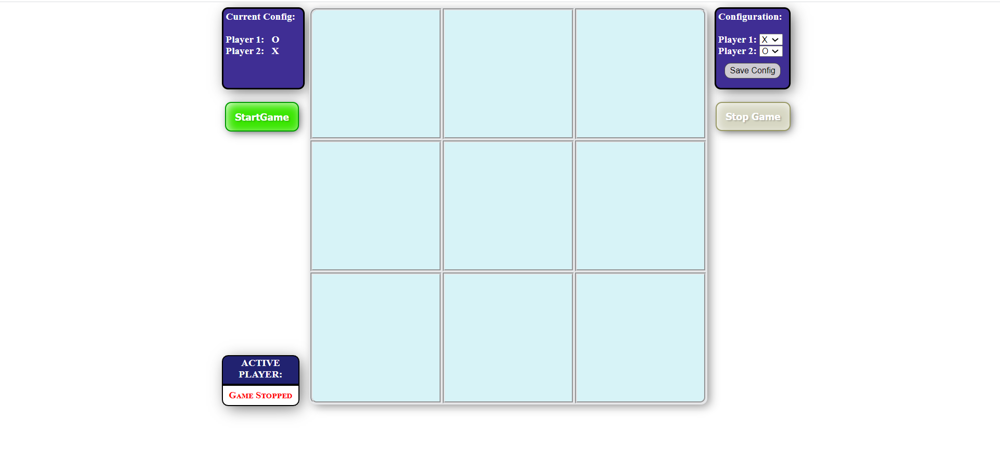
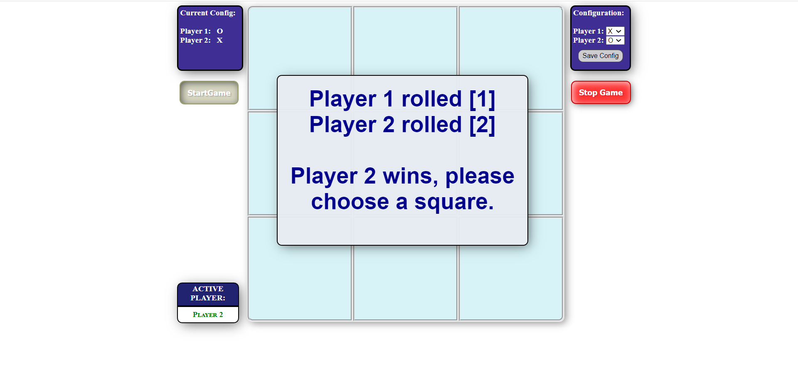
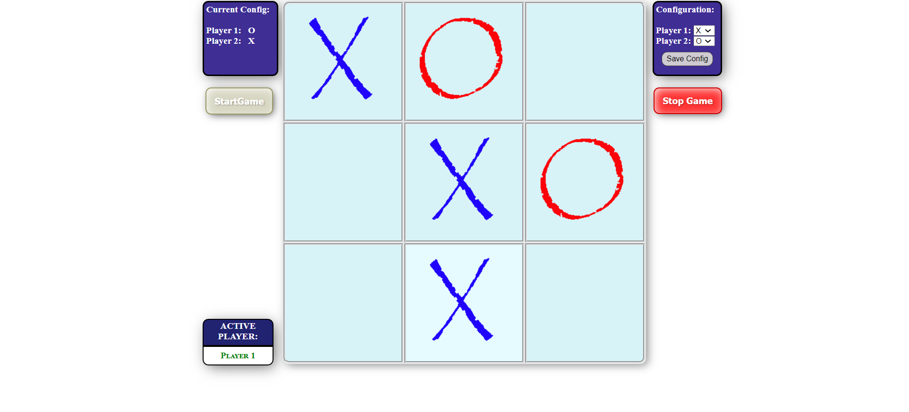
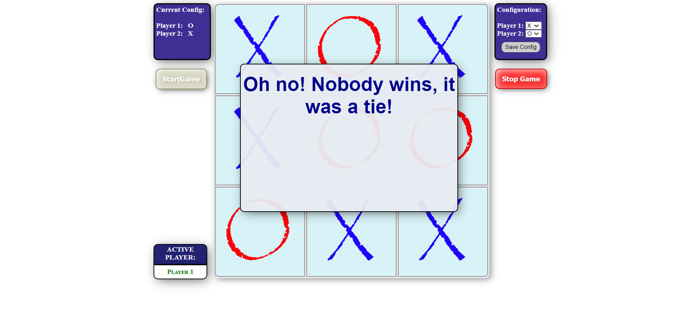

# TicTacToe
Tic Tac Toe Game using HTML, CSS, and JS.
In this project I worked along the side of the insctructor building this Tic-Tac-Toe Game. I used Visual Studio Code to edit and write my code. It was a pleasurable experience as I got to use HTML, CSS, and JavaScript all together to build a working game and was able to get it all done inside VS Code.

Here are some screen shots to show the end result:

